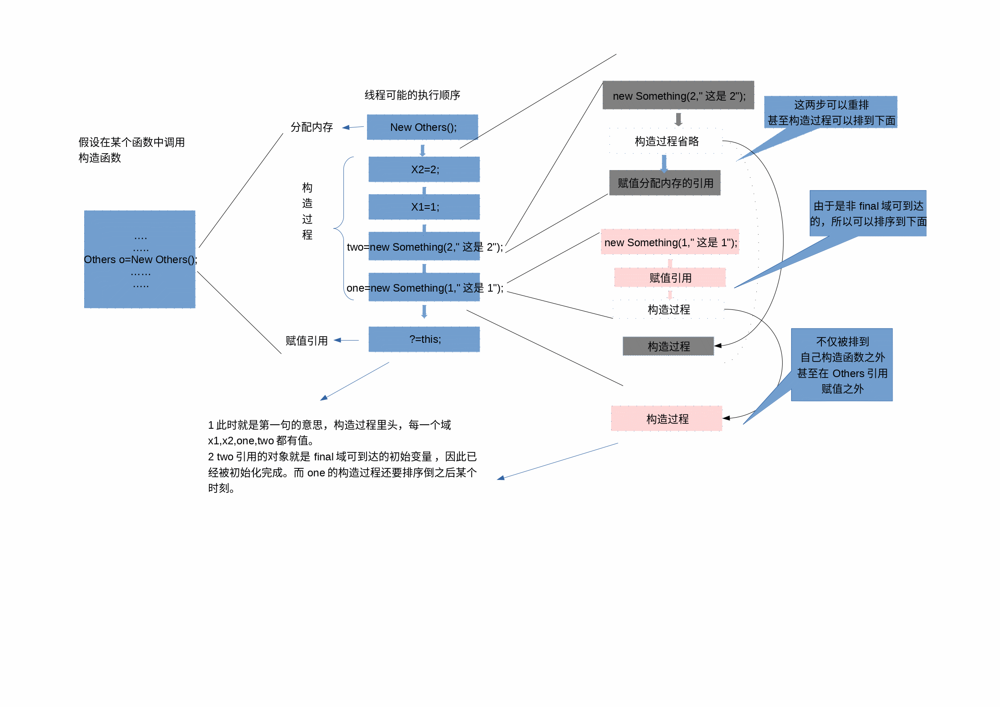

# 并发
 * 在一些情况下，很多问题都具有并行结构，并行观念编写程序更容易。
 * 设计并行程序带来效率和性能上的提升，远大于并发复杂性。
## 线程安全
  通常情况下线程安全指的是 线程安全的类和线程安全的程序。

* 线程安全的类

  先定义程序在单线程中的执行无论是过程还是结果都是正确的或者说可预期的，
  如果在多线程中的执行和在单线程中执行完全一样，那么就是线程安全的。
  也就是说线程对于程序来说是完全透明的，程序出现所有情况不应该是因为使用线程原因造成的。
  如果说某个类是线程安全的，就不用考虑所有任何线程安全问题了。
* 线程安全程序

  有时候，即使一个类是线程安全的，在部分程序片段中由于设计考虑欠佳，例如某些复合操作由于竞态条件问题，导致程序出现错误
  这时候，线程安全问题不再仅仅是线程安全类的责任了，因此程序设计者应该保证程序是线程安全的。
## 16章java内存模型
## happen-before
  java并发编程实战中的描述我没办法理解，想了很久，觉得应该是下面的意思
 ```
 如果a线程解锁，b线程加锁。
 并且a b线程已经发生这两件事，那么a解锁发生在b加锁之前。
 ```
## 初始化安全性
 ```
  1 对于含有final域的对象，初始化安全性可以防止对对象的初始引用被重排序到构造过程之前。
  2 对于通过final域可到达的初始变量的写入操作，将不会与构造过程后的操作一起被重排序。
 ```
 我的理解是：对于第一句话，在构造函数中对于所有域（final域和非final域）的写入操作，都将在初始引用被赋值的操作之前。也就是说其他线程一旦得到初始引用后，类内的域都将有在构造函数以内写入的值。
 
 第二句话是第一句话的补充，final域引用写入完成时，域引用的对象已经初始化完成。也就是在获取final引用域时，引用的对象已经初始化完了。
假设有如下类：
```java
class Something{
  private int x;
  private String s;
  public Something(int xx,String ss){
   x=xx;
   s=ss;
 }
}
public class Others{
 private int x1;
 private final int x2;
 private Something one;
 private final Something two;
 public Others(){
  x1=1;
  x2=2;
  one=new Something(1,"这是1");
  two=new Something(2,"这是2");
 }
}
```
假设在某个线程中执行Others构造函数，这是可能的执行流程：

 
